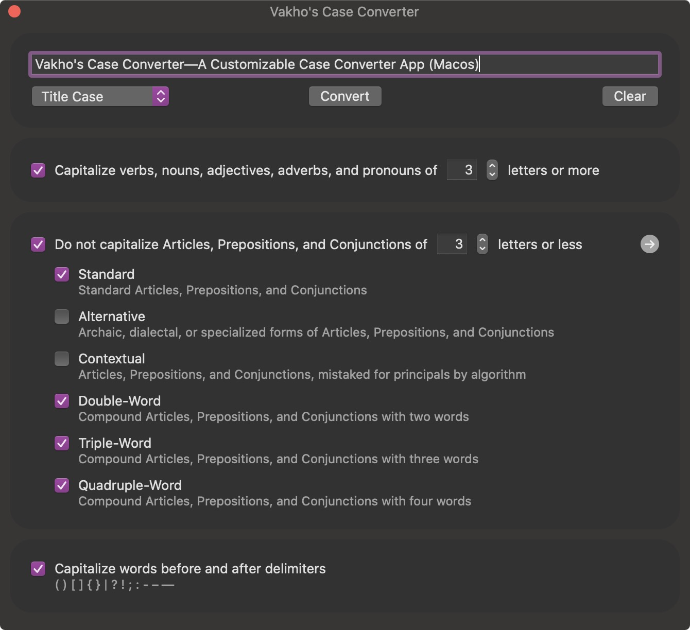

# Vakho's Case Converter

## Table of Contents
- [Description](#description)
- [Technologies](#technologies)
- [Setup](#setup)
- [Examples](#examples)
- [Contact](#contact)

## Description
Vakho's Case Converter is an open-source utility app for macOS. You can use the app to convert phrase to standard cases, as well use use highly customizable title case.

#### General Features:
- Standard cases—lower, upper, title, sentence, capital, alternate, and toggle
- Customizable title case
- Ability to add custom words

## Technologies
App was developed on macOS 10.15 Catalina in XCode 11/12. UI was build using SwiftUI, and no external libraries and frameworks were used.

## Setup
You can simply clone the project and build the app from XCode.

## Examples

## Contact
e-mail: [vakho.kontridze@gmail.com](mailto:vakho.kontridze@gmail.com)
